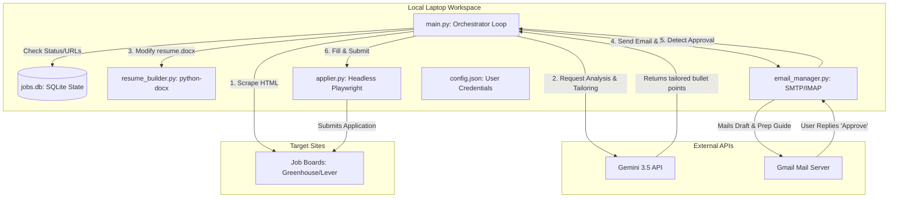

# Job Application Agent - Technical Documentation & Architecture

This document provides a comprehensive technical overview of the automated Job Application and Resume Tailoring Agent custom-built in the workspace.

---

## 🏗️ System Architecture

The agent is designed as a locally hosted state-machine orchestrator that interfaces with external services (Gemini API, Gmail SMTP/IMAP) and automates a web browser using Playwright.

---

## 🗂️ Component Details

### 1. Orchestration & State Machine (`main.py`)
*   **Database Schema (`jobs.db`)**: Manages job application states using SQLite.
    *   `id`: MD5 hash of the job URL.
    *   `url`: Target application webpage.
    *   `status`: Enumerated states: `discovered` ➔ `pending_approval` ➔ `applied` (or `failed`).
    *   `tailored_resume_path`: Absolute path of the Word document generated for that specific application.
*   **Web Scraper**: Leverages Playwright to load job board URLs, waits for the DOM load state (`networkidle`), extracts raw text from the DOM body, and decomposes irrelevant tags (`<script>`, `<style>`).
*   **AI Extraction**: Passes raw HTML page content to the Gemini API with structured instructions, returning a clean JSON object containing `{ "company": "...", "title": "...", "description": "..." }`.

### 2. Resume Customization Engine (`resume_builder.py`)
*   **Document Parsing**: Reads Preethi's standard `resume.docx` using `python-docx`.
*   **AI Bullet tailoring**: Queries Gemini with the original resume text and target job description. The model identifies 3-5 high-impact bullet points and rephrases them, incorporating target keywords (e.g., SQL, Power BI, Azure) without fabricating skills or work history.
*   **Style-Preserved Replacement**: Traverses paragraphs and tables in the XML structure of the Word document, substituting the target strings in place to preserve font sizes, margins, alignments, and the Steel Blue styling theme.

### 3. Communication Bridge (`email_manager.py`)
*   **SMTP Service**: Authenticates via Gmail SMTP (`smtp.gmail.com:587`) using TLS to send outgoing draft notifications. Generates a custom HTML template detailing the role overview, target company insights, and 5 custom-tailored behavioral/technical interview prep questions.
*   **IMAP Listener**: Connects securely to `imap.gmail.com:993` to search incoming messages.
    *   Filters emails containing the subject query `[JobAgent Approval Required]`.
    *   Isolates the new reply content by stripping out the quoted email history threads (`On Mon, Jul 13...` / `-----Original Message-----`).
    *   Checks the cleaned body text for positive responses (e.g., "approve", "yes", "apply").
    *   Flags the matched message as read (`\Seen`) to prevent duplicate runs.

### 4. Browser Automation (`applier.py`)
*   **Invisible Headless Execution**: Launches an instance of Chromium in headless (invisible) mode to run silently in the background of your laptop.
*   **Autofill Mappings**: Scans the target application page using robust CSS selector lists targeting common field IDs, names, and placeholders (e.g., `first_name`, `email`, `phone`, `linkedin`).
*   **Custom Questions AI Engine**:
    *   First checks the `config.json` candidate profile for deterministic matches (State: *Texas*, Sponsorship: *No*, Visa: *H4 EAD*).
    *   For custom text questions, it reads the label text, sends it to Gemini along with her resume, and writes a natural, brief (1-3 sentences), first-person response (`"I..."`).
*   **Document Upload**: Automates file inputs (`input[type='file']`) to upload the correct tailored `.docx` document.
*   **Redirection Verification**: Locates the form's submit button, clicks it, and monitors the browser's final URL and page content for confirmation keywords (*Thank you*, *Success*, *Confirmed*). Captures and saves screenshots to the folder on failure to aid debugging.

---

### 5. Portfolio Project Proposal Engine (`project_proposer.py`)
*   **Skill-Gap Detection**: Compares real, in-demand skills from job postings scraped in the last 60 days (`jobs.db.skills_needed`) against skills already demonstrated in existing portfolio project READMEs (`C:\Projects\Preethi\*\README.md`). The most in-demand skill with the least/no portfolio coverage becomes the target for the next proposal.
*   **AI Proposal Drafting**: Sends the skill gap and market-demand context to Gemini, which returns one concrete project proposal built on a real, named public dataset (Kaggle, UCI, AWS Open Data, etc.) -- never a fabricated dataset. The prompt explicitly scopes any time-partitioned dataset to only the latest available slice, not the full historical range.
*   **Approval-Gated Email**: Proposals are logged to `project_proposals.json` (status `proposed`) and emailed with subject `[JobAgent Project Proposal] ID:<id>`. Nothing is scaffolded or built until Preethi replies "Approve" -- detected by the same `email_manager.py` IMAP polling loop used for job approvals, checked every ~60 seconds regardless of which day she replies.
*   **Proposal Cadence**: A Windows Scheduled Task (`PreethiPortfolio_WeeklyProjectProposal`) triggers `main.py propose-project` every Monday and Thursday at 9 AM -- deliberately not daily, to avoid recreating the same "manufactured activity" problem the Git Activity Engine (Section 2A) was fixed for.
*   **Autonomous Build**: A separate scheduled cloud routine (`build-approved-portfolio-project`, daily) checks for any `approved`-but-unbuilt proposal and builds it end-to-end without human confirmation: real data sourcing, real code, a Word doc report matching the existing Steel Blue report style, a portfolio site card via `regenerate_portfolio_projects.py`, and one briefing email (CID-embedded chart + docx attachment, same pattern as Section 1's job launch emails). Any cloud resources created for the build (e.g. AWS S3/Glue) are torn down immediately afterward to avoid ongoing cost.
*   **AWS Access Caveat**: When a proposal requires AWS, the build uses a scoped IAM Identity Center permission set (`preethi-portfolio` CLI profile, account `099771438185`, least-privilege -- not admin). Its SSO session expires roughly every 8 hours and can only be refreshed by an interactive `aws sso login`, which the autonomous routine cannot do itself -- if the session has expired, it leaves the proposal as `approved` (not `built`) and reports that a human needs to refresh the login, rather than failing silently or faking a result.
*   **First real example**: `aws-nyc-taxi-analytics` -- built via this pipeline, including a real mid-build correction (the public `s3://nyc-tlc` bucket denies direct listing even to authenticated AWS accounts, so the pipeline re-hosts the data from its public CloudFront endpoint into a personal S3 bucket instead).

---

## 🔒 Security & Best Practices

1.  **Google App Passwords**: Eliminates the need to store your master Google account password. The 16-character string is restricted solely to mail sending and reading protocols, providing an isolated security layer.
2.  **Safety Fail-Safes**: If the browser detects a visible, active puzzle CAPTCHA, or if the form fails to submit after clicking, the agent immediately halts, flags the database status as `failed`, saves a screenshot, and emails Preethi an alert notification containing the exact error log and the direct job link.
3.  **Local SQLite Storage**: Candidate profiles and application histories are stored locally on your machine, ensuring data privacy and reducing reliance on third-party cloud database platforms.
4.  **Scoped Cloud Access**: Any AWS work uses IAM Identity Center with a custom permission set limited to only the services a given project needs (e.g. S3/Glue/Athena) -- never the account's full admin access -- and cloud resources created for a project are torn down once it's delivered.
