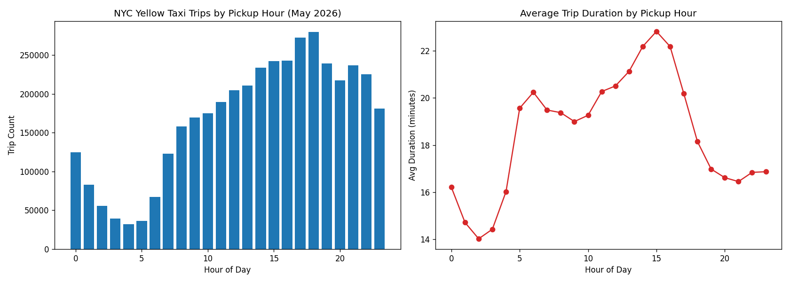

# AWS Cloud Analytics Pipeline: NYC Taxi Trip Data

## Why this project
Closes a real skill gap identified from Preethi's actual target job postings: **AWS** (specifically S3, Glue, and Athena), building on her existing SQL and Python foundation.

## Dataset
- **Source:** NYC Taxi & Limousine Commission (TLC) Trip Record Data, distributed via the [AWS Open Data Registry](https://registry.opendata.aws/nyc-tlc-trip-records-pds/)
- **Format:** Parquet
- **Scope:** Latest available month only (currently `2026-05`), not the full historical archive — keeps the dataset size and any Athena scan costs small.

### Important correction from the original proposal
The original plan assumed AWS Glue could crawl `s3://nyc-tlc/...` directly. In practice, that bucket **denies `s3:ListBucket`** even to authenticated AWS accounts (confirmed by testing) — TLC serves the actual files through a public CloudFront endpoint instead:

```
https://d37ci6vzurychx.cloudfront.net/trip-data/yellow_tripdata_2026-05.parquet
```

So the real pipeline is:

1. Download the latest month's Parquet file from the CloudFront URL (`download_data.py`).
2. Upload it to **your own** S3 bucket (you own it, so Glue/Athena can actually list and read it).
3. Point an AWS Glue crawler at your bucket to build the Data Catalog.
4. Query the cataloged table with Amazon Athena.
5. Pull results into pandas via `boto3` for analysis/visualization (`analysis.ipynb`).

## Setup
1. Create an S3 bucket for this project (pick a globally-unique name), e.g.:
   ```
   aws s3 mb s3://YOUR-BUCKET-NAME --profile preethi-portfolio --region us-east-2
   ```
2. Update `BUCKET_NAME` in `download_data.py` with that bucket name.
3. Run `pip install -r requirements.txt`.
4. Run `python download_data.py` to pull the real data and upload it to your bucket.
5. In the AWS Glue console, create a crawler pointed at `s3://YOUR-BUCKET-NAME/trip-data/`, run it to populate the Data Catalog.
6. In Athena, point at the database the crawler created, and run queries against the table (see `analysis.ipynb` for starter queries).
7. Use `analysis.ipynb` to pull Athena query results into pandas and build visualizations.

## Deliverables
- [x] AWS Glue Data Catalog table for the trip data (`nyc_taxi_portfolio_db.trip_data`, 19 columns, schema inferred automatically by the crawler)
- [x] Athena SQL queries exploring trip duration / peak hour trends
- [x] Jupyter notebook with boto3 + pandas analysis and charts (`analysis.ipynb`)
- [x] Findings below

## Findings (May 2026 data, 4,038,773 trips)

| Metric | Value |
|---|---|
| Total trips | 4,038,773 |
| Average trip distance | 4.98 miles |
| Average fare | $21.56 |
| Average trip duration | 19.0 minutes |

**Peak hour:** 6 PM (279,829 trips), followed closely by 5 PM (272,245 trips) — the two busiest hours of the day, consistent with the evening commute.

**Quietest hour:** 2 AM (55,893 trips) — roughly 5x fewer trips than peak.

**Longest average trips:** 3 PM (~22.8 minutes average) and 2 PM (~22.2 minutes) — likely mid-afternoon traffic congestion rather than distance, since average trip distance during these hours is actually *shorter* than early-morning hours.

**Shortest average trips:** 2 AM (~14.0 minutes) — consistent with light overnight traffic.



## Tech stack
AWS S3, AWS Glue, Amazon Athena, boto3, pandas, IAM Identity Center (SSO)
